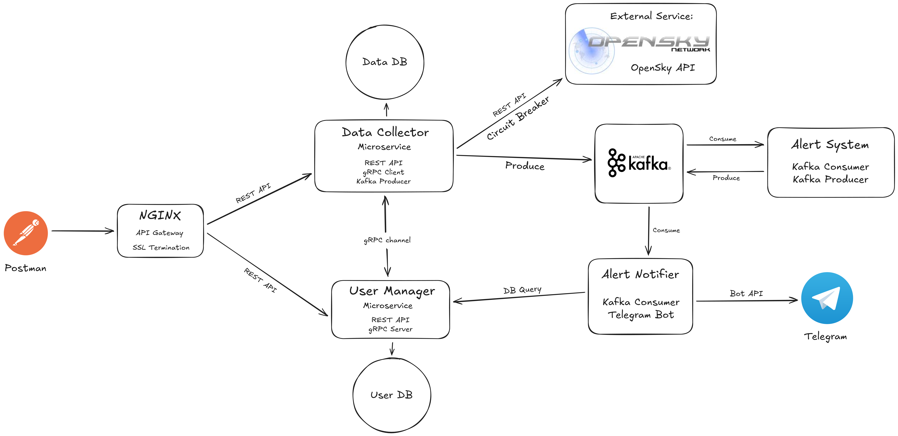

# Distributed Systems and Big Data (DSBD) Homework

This project is a distributed system designed to manage user information and collect/process flight data from the OpenSky Network through a microservices architecture.

This project is a distributed system, developed as part of the Distributed Systems and Big Data course.

**Students:**
- Dario Camonita
- Matteo Jacopo Schembri

## Project Status

This project is currently a **Work in Progress (WIP)** and is not intended for production use. It has been developed and tested on GNU/Linux and macOS.

## Architecture



The system implements an **"at-most-once"** delivery policy for state-changing operations on the User Manager service, ensuring that requests are never processed more than once, even in the event of network retries.

## Documentation

- The project guidelines are described in the `homework.pdf` file.
- Detailed technical documentation, including API endpoints and architectural choices, is available in `doc.md`.

## Coding Standards

The Python code in this project adheres to the **PEP 8** style guide. All docstrings for modules, classes, and functions are written to comply with the **PEP 257** standard.

## Setup and Execution

This project is managed using Docker and Docker Compose.

### Prerequisites

- Docker
- Docker Compose (v1 or v2)

### Configuration

Before running the application, you need to configure your OpenSky Network API credentials.
1.  If it's not present, rename the `.env.example` file to `.env`.
2.  Open the `.env` file and replace `your_api_client_id` and `your_api_client_secret` with your actual OpenSky Network credentials.

### Running the Application

You can run the entire application using Docker Compose.

**Using Docker Compose v2 (recommended):**
```bash
docker compose up --build
```

**Using Docker Compose v1 (legacy):**
```bash
docker-compose up --build
```

### Stopping the Application

To stop the containers, run:
```bash
# For v2
docker compose down

# For v1
docker-compose down
```

### Cleaning Up

To remove all stopped containers, networks, and volumes (this will delete all data in the databases), you can run:
```bash
docker system prune -a
```

### Example API Calls

**Ping User Manager:**
```bash
curl http://localhost:5001/ping
```

**Ping Data Collector:**
```bash
curl http://localhost:5002/ping
```

**Add a new user:**
```bash
curl -X POST http://localhost:5001/users \
-H "Content-Type: application/json" \
-d '{"email": "mario.rossi@example.com", "first_name": "Mario", "last_name": "Rossi", "tax_code": "RSSMRA80A01H501U", "iban": "IT60X0542811101000000123456"}'
```

**Get a user:**
```bash
curl http://localhost:5001/users/mario.rossi@example.com
```

### Postman Collection

For a comprehensive set of API calls, a Postman collection named `DSBD.postman_collection.json` is available in the root directory of this repository. You can import this file into Postman to easily test all the exposed endpoints.

## OpenSky API

- **Documentation**: https://openskynetwork.github.io/opensky-api/rest.html
- **Limitations**: https://openskynetwork.github.io/opensky-api/rest.html#limitations
